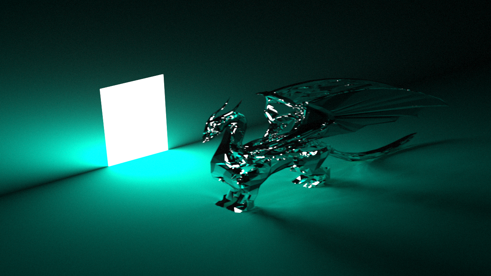
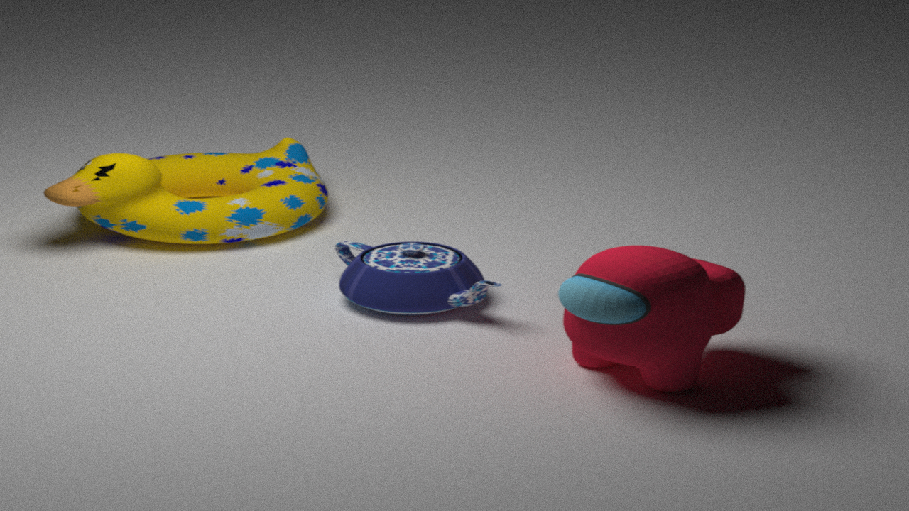
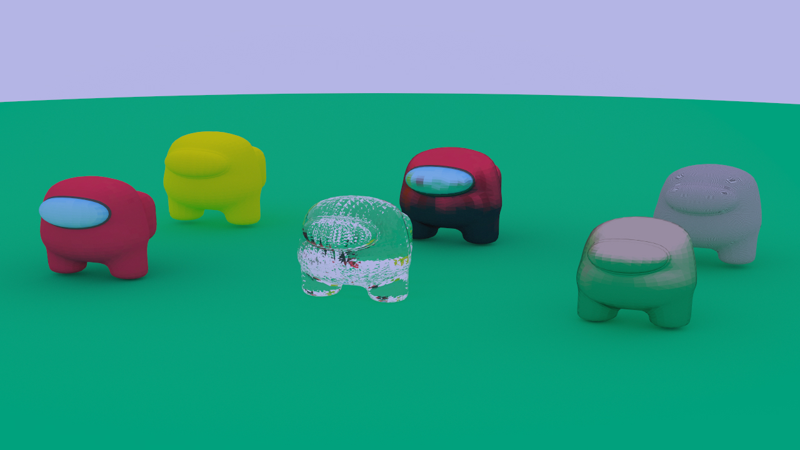
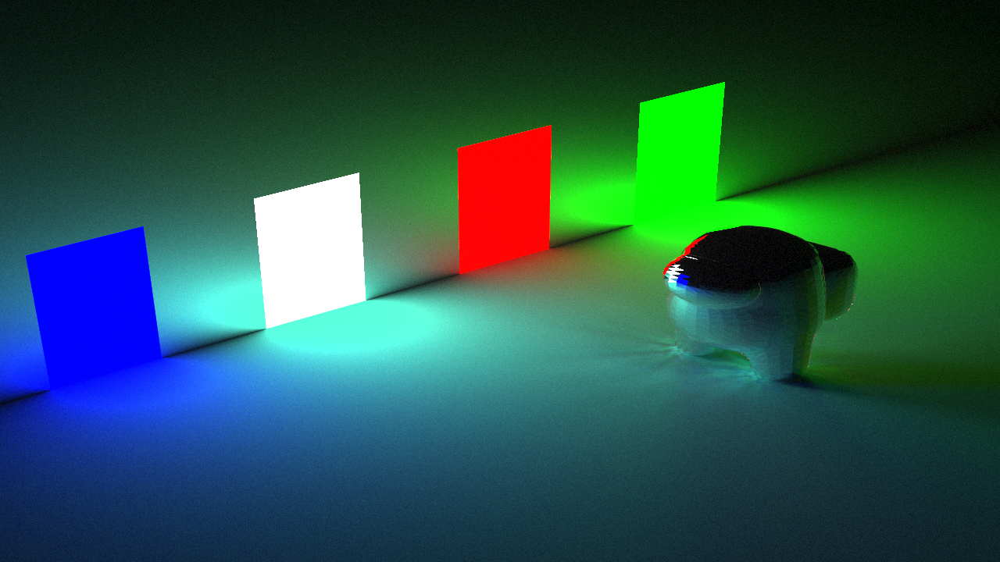

---
title: Proyecto Final Computación Gráfica
author: Mauro Schiavinato
date: 11-02-2022
...
\newcommand{\img}[1]{\begin{center}\includegraphics[width=0.7\textwidth]{#1}\end{center}}

# Informe
El trabajo consiste en la implementación de un motor de renderización basado en ray tracing. Este se basó ampliamente en las guías [Ray Tracing in One Weekend](https://raytracing.github.io/books/RayTracingInOneWeekend.html) y [Ray Tracing: The Next Week](https://raytracing.github.io/books/RayTracingTheNextWeek.html).

## Agregados
Funcionalidades agregadas sobre la guía de Shirley:  

- Malla de triángulos y polígonos (con lectura de OBJ).
- Reestructuración del código.
- Cálculo multithreading con visualizador de porcentaje y tiempo estimado.
- Lectura de configuración en runtime desde json.
- Formatos de imágenes de salida.

## Obstaculos durante el desarrollo
### Triangle Mesh
Me encontré muy difícil agregar una malla de triángulos sin utilizar alguna manera para dividir el espacio en cajas para optimizar la performance.  
Para ver el impacto de usar fuerza bruta podemos calcularlo: El modelo inicial fue el de among us el cual tiene 3412 triángulos. Con 20 rayos por píxeles con 5 rebotes por rayo tenemos 3412\*20\*5, lo cual sería 3 millones de cálculos por píxel. Un número prohibitivo de operaciones para calcular cuando vemos cuantos píxeles tiene una imagen.  
Para subdividir el espacio traté primero hacerlo dividiendo el espacio mediante cajas de igual tamaño. Las cajas se formaban mediante 6 caras, donde cada cara se formaba mediante 2 triángulos. Esto conllevaba muchos cálculos para ver si el rayo le pega a la bounding box. Luego de encontrarme con la implementación del libro de ray tracing de Shirley y por la simpleza, decidí quedarme con su implementación la cual utiliza Axis-Aligned bounding boxes que son rápidas para computar la intersección con rayos y además no subdivide el espacio en partes iguales, sino que subdivide el espacio de tal manera que subdivide uniformemente la cantidad de objectos en cada subdivisión del espacio (lo cual hace que no tengamos subdivisiones innecesarias).

Luego para la intersección con un triángulo, usé la implementación del libro del Fundamentals of Computer Graphics Shirley.

Al comenzar a implementarla me encontré con este error visual:

\img{../renders/25spp-10r-02-01-2022.png}

El cual se producía porque no le agregaba la normal al triángulo, entonces algunos tríangulos tenían la normal para el otro lado. El código del material le importa la dirección de la normal porque es usada para el rebote, aunque podría hacerse que no. Pero está bueno si se quiere algún efecto que dependa de si la cara es exterior o inferior (un ejemplo podría ser un panel de luz).  
Luego de solucionarlo:

\img{../renders/25spp-10r-03-01-2022.png}

Como los OBJ tienen una normal para cada vértice, tomo la normal de cada triángulo como promedio de las normales de cada vértice.

### Multithreading rendering
El primer intento de dividir el trabajo fue el más simple que se me ocurrió: dividir el alto entre la cantidad de cores del cpu y que cada uno computara una banda de la imagen.
Un problema que luego descubrí con ese método, es que siempre los cores terminaban de manera desigual dejando recursos de cpu sin usar. Esto tiene que ver con que el tiempo de computo de un pixel depende de lo que estamos rendereando, y sucede que no es uniforme para cada pixel, teniendo partes donde hay poco computo (computar el fondo) y otras donde hay más (objetos que reflejan).
Para solucionar eso, reordenando la forma de computo a una más uniforme: 

- El 1er core computa los pixeles: 0, cant_cores, cant_cores\*2, ...
- El 2do core computa los pixeles: 1, 1+cant_cores, 1+cant_cores\*2, ...
- El 3er core computa los pixeles: 2, 2+cant_cores, 2+cant_cores\*2, ...
- ... 

Lo único malo de computar de esta manera es que no es uniforme calcular el tiempo estimado, por lo cual el programa no estima muy bien. Aunque el tiempo es difícil calcularlo de cualquier manera porque depende de como esté estructurada la escena.

### Carga muy lenta de OBJ
Partí haciendo copy-paste de la carga de OBJ de proyectos anteriores de la materia. 
Tomaba mucho tiempo desde que empezaba el programa hasta que empezaba a calcular los rayos (20 segundos), suponiendo que era problema de la carga de OBJ. Luego de hacer profiling, noté que el código de Shirley para los BVH generaba una copia recursivamente del arreglo de objectos, haciendo muy lento el código. Luego de sacarlo y hacerla mutable pasó a 4 segundos. Para hacer el profiling me encontré que la manera más rápido (porque valgrind era una tortuga) era parando el debugger en momentos dados y viendo donde caía, más info en [esta respuesta](https://stackoverflow.com/questions/375913/how-can-i-profile-c-code-running-on-linux). Debido a este problema al principio al importar modelos de afuera les rebajaba la cantidad de triángulos mediante blender (tiene una opción).

### Parser de OBJ
Un error ya terminando el proyecto fue durante la lectura de los OBJ. Sucede que algunos archivos de los modelos como el among us, teapot y dragon tienen dos espacios entre la "v" (vértice) y la definición mientras que por ejemplo el duck tiene un solo espacio. Pero lo interesante es que no tiraba nunca ninguna excepción al saltearse un símbolo del float a continuación: si le pasas *.18* te lo toma como *0.18*. Pero si le pasas un número negativo te sacaba el signo. El error generaba que a veces se salteaba el signo del número, generando este efecto visual en el duck:

\img{../renders/error-obj-file.jpg}
\img{../renders/error-obj-file2.jpg}

Y luego de corregirlo:

\img{../renders/4000spp-50r-10-01-2022.jpg}

## Ayuda con blender

Algunas veces me manejaba con Blender para ver la escala que debían quedar los objetos y en que posición, ya que correr el programa tarda bastante tiempo.

\img{imgs/blender.png}

## Renders finales

## Ambiciones no hechas
- Soportar OBJ más complejos: con múltiples mallas adentro y con múltiples imágenes para texturas.
- Animaciones
- Crear la escena desde el navegador web con el [editor de three.js](https://threejs.org/editor) y mediante un servidor web generar el rending final y mandarlo al navegador de nuevo. Es decir generar una app web para el proyecto y agregarle un editor acelerado para crear la escena.
- Aceleración de hardware: Utilizar las funcionalidades de las GPU RTX para producir imágenes.
